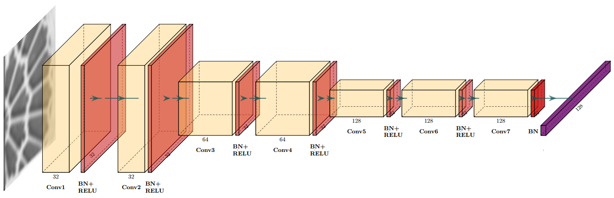
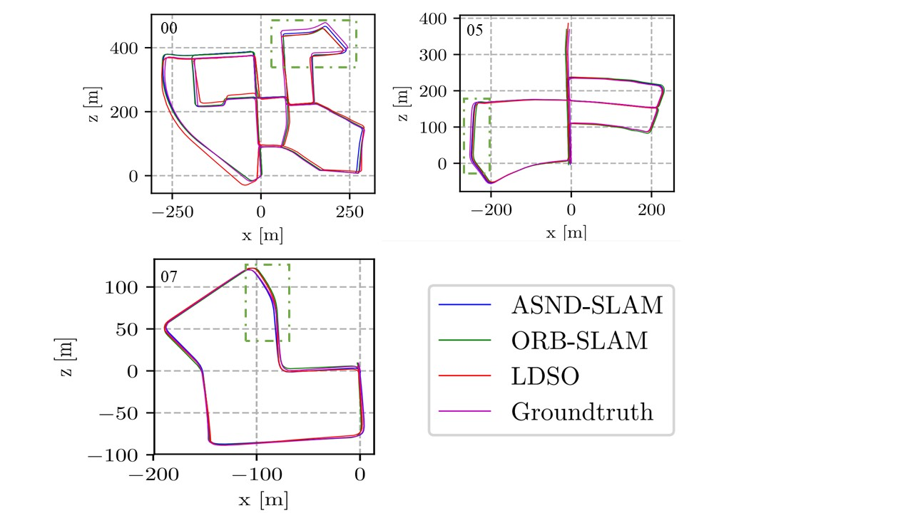
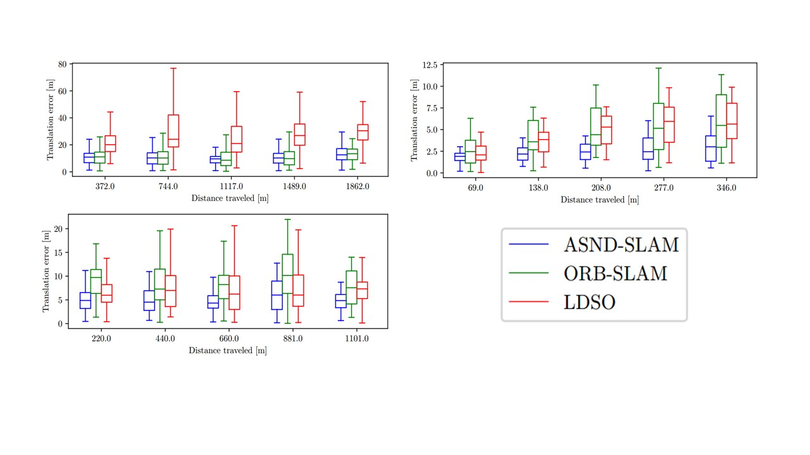
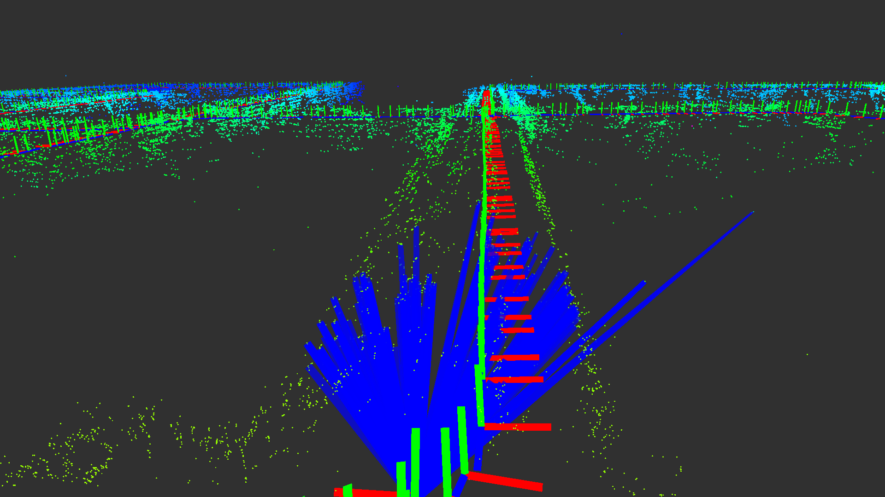

# ASD-SLAM
This repository contains two parts: one is ASDNet generating ASD in folder ASDNet, the other is ASD-SLAM which derived from ORB-SLAM2.  
## Dependency

- [ROS](http://wiki.ros.org/ROS/Installation) (tested with indigo and kinetic)
- [Libtorch](https://github.com/pytorch/pytorch)  
  ```
  https://github.com/pytorch/pytorch.git
  git submodule update --init --recursive 
  mkdir build
  cd build
  python ../tools/build_libtorch.py
  ```

## Compile

You can use the following commands to download and compile the package.

```
git clone https://github.com/mataiyuan/ASD-SLAM.git
cd ASD-SLAM && catkin build vslam
```
When you compile the code for the first time, you need to modify CMakeLists.txt in folder vslam, you should set your own APPEND CMAKE_PREFIX_PATH `list(APPEND CMAKE_PREFIX_PATH "/home/mataiyuan/Ku/pytorch/torch/share/cmake/Torch")`.

## NetWork
<p align='center'>
    
</p>

## Run the package

1. Run the ASDNet.py to train to learn descriptors ASD
```
python ASDNet.py
```

2. run ASD-SLAM on KITTI or EUROC datasets:
```
bash run_vslam_kitti.sh  
or  
bash run_vslam_euroc.sh
```


## Experiment Results

we test ASD-SLAM  LDSO ORB-SLAM2 on KITTI datasets , the results are in folder `/experiment_result`. you can evaluate the results with [rpg_trajectory_evaluation](https://github.com/uzh-rpg/rpg_trajectory_evaluation).

<p align='center'>
    
</p>
<p align='center'>
      
</p>

## Show the map

After you run  bash run_vslam_kitti.sh or bash run_vslam_euroc.sh , it will save the `map.map` and trajectory in folder `/DataSave`, the format of trajectory is origanized as `timestamp , qx , qy , qz , qw , px , py , pz`. If you want to check the map, you can build the folder `display_map` like this:  
  ```
  catkin build display_map --no-deps
  ./display_map map_dir
  ```
<p align='center'>
      
</p>
    
